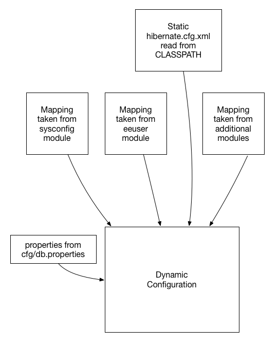

Several jPOS-EE components rely on the `dbsupport` module to configure and access
the underlying database (or databases) using Hibernate.

One of the most used class is `org.jpos.ee.DB` and its usage is straightforward:

[source,java]
-------------
    DB db = new DB();
    db.open();
    ...
    ...
    db.close();
-------------

If you want to update the database, your code may look like this:

[source,java]
-------------
    DB db = new DB();
    db.open();
    db.beginTransaction();
    ...
    ...
    db.commit();
    db.close();
-------------

The DB object implements the `Closeable` interface, so you can use the try-with-resources construct like this:

[source,java]
-------------
    try (DB db = new DB()) {
        db.open();
        db.beginTransaction();
        ...
        ...
        db.commit();
    }                                <1>
-------------
<1> No need to call `db.close()` as `DB implements Closeable`.

Also, the `DB` object provides a couple of functional alternatives to the code above:

[source,java]
-------------
DB.exec ((db) -> {
    return db.session().get(YourObject.class, yourId);
});
-------------

or `execWithTransaction` that encloses your function within a `beginTransaction/commit` block.

[source,java]
-------------
DB.execWithTransaction((db) -> {
    db.session().save(obj);
    return obj;
});
-------------

[NOTE]
======
Very often we find ourselves answering the question WHY (on earth) we have this
`DB` object instead of just using Hibernate session factory and sessions
directly. The answer comes from the history of jPOS-EE, which initially used an
object-oriented database (ObjectStore). ObjectStore had a `DB` object that one
had to instantiate to access the database, and we were used to it. Interesting
enough, ObjectStore helped model JDO, which in turn influenced the JPA we have
today.

Once we moved away from the object-oriented database to Hibernate, we found it
useful to keep that DB object around used by our code, slightly isolating us
from Hibernate and providing some helper functionality, and that's the only
reason there's a DB object in jPOS-EE.
======

=== DB Support configuration

Hibernate applications are usually configured by means of a single `hibernate.cfg.xml` file
that looks like this:

[source,xml]
------------

<!DOCTYPE hibernate-configuration PUBLIC
    "-//Hibernate/Hibernate Configuration DTD 3.0//EN"
        "http://www.hibernate.org/dtd/hibernate-configuration-3.0.dtd">

<hibernate-configuration>
    <session-factory>
        ...
        ...
        <mapping class="org.jpos.ee.SysConfig"/>
        <mapping resource="org/jpos/ee/User.hbm.xml" />
        <mapping resource="org/jpos/ee/Consumer.hbm.xml" />
        <mapping resource="org/jpos/ee/Revision.hbm.xml" />
        <mapping resource="org/jpos/ee/Role.hbm.xml" />
        <mapping class="com.your.company.entity.YourEntity" />
        ...
        ...
    </session-factory>
</hibernate-configuration>
------------

Besides standard configuration (c3p0, jdbc, transaction isolation), the `hibernate.cfg.xml` file has
a collection of mappings for your application's entities, but jPOS-EE applications are built _à la carte_
picking modules from the jPOS-EE modules offeering, as well as customer specific modules.

So if an application wants to use jPOS-EE DB support using say Postgresql backend, and wants to use the
`sysconfig` module, and `eeuser` module, you would add the following dependencies:

[source,groovy]
--------
   compile "org.jpos.ee:jposee-db-postgresql:${jposeeVersion}" <1>
   compile "org.jpos.ee:jposee-sysconfig:${jposeeVersion}"
   compile "org.jpos.ee:jposee-eeuser:${jposeeVersion}"
--------
<1> the `db-postgresql` depends on `dbsupport` so no need to include it explicitly

But upon adding these modules as a dependency, the developer would have to manually add
these mappings to the `hibernate.cfg.xml`.

In addition, as part of the edit work, you need to specify the Hibernate dialect to be used
(i.e. `org.hibernate.dialect.MySQL5InnoDBDialect` for MySQL, or `PostgreSQLDialect` for Posgresql),
JDBC URL, etc.

jPOS-EE uses a simple convention to dynamically create the Hibernate configuration file based on the
following rules:

* It uses an initial 
  link:https://github.com/jpos/jPOS-EE/blob/master/modules/dbsupport/src/main/resources/hibernate.cfg.xml[hibernate.cfg.xml]
  template available in the application's CLASSPATH as starting point.

* It scans the classpath looking for XML configuration files in each dependency jar inside the
  `META-INF/org/jpos/ee/modules`, for example, the `eeuser` module has the file:

[source,xml]
------------
<module name="eeuser">
    <mappings>
        <mapping resource="org/jpos/ee/User.hbm.xml" />
        <mapping resource="org/jpos/ee/Consumer.hbm.xml" />
        <mapping resource="org/jpos/ee/Revision.hbm.xml" />
        <mapping resource="org/jpos/ee/Role.hbm.xml" />
    </mappings>
</module>
------------

So those mappings become part of the main Hibernate configuration. 
See link:https://github.com/jpos/jPOS-EE/blob/master/modules/eeuser/src/main/resources/META-INF/org/jpos/ee/modules/eeuser.xml[eeuser.xml]

* Finally, it searchs for a `cfg/db.properties` file in the current working directory for additional configuration and overrides.

Here is a sample `db.properties`:

[source]
--------
hibernate.connection.username=sa
hibernate.connection.password=password
hibernate.hbm2ddl.auto=validate
hibernate.connection.url=jdbc:postgresql://localhost:5432/jposee
hibernate.connection.driver_class=org.postgresql.Driver
hibernate.dialect=org.hibernate.dialect.PostgreSQLDialect
--------

[TIP]
=====
In addition to the XML module mapping file available in each module's classpath, the `db-*` set of modules
(such as `db-mysql`, `db-postgresql`, etc.) has a sample `db.properties` file included in its
`META-INF/q2/installs/cfg` directory, so a call to `gradle installResources` or the `install` CLI command
(that you can invoke by calling `q2 --cli`) will export it to the operating system, where you can easily
edit it.
=====

So to recap, the following diagram shows how a dynamic `hibernate.cfg.xml` configuration is created when
we call `DB db = new DB()` with no arguments:

remember, the `mapping` files are taken from the special `META-INF/org/jpos/ee/modules/*.xml`.

[TIP]
=====
This configuration is suitable for situations where you have to connect to a single JDBC endpoint
and access and map a unique set of entities. If that's not your case, read below for additional
options.
=====

==== Accessing a secondary/slave database

If you want to access an alternate database, you can use a modifier when instantiating your DB object,
for example:

[source,java]
-------------
   DB db = new DB ("slave");               <1>
   db.open();
   db.session().setDefaultReadOnly(true);  <2>

   ...
   ...
-------------
<1> We call this constructor parameter a 'config modifier'
<2> If this is a real `slave`, you may want to set the underlying Hibernate session to read-only mode.

In this case, jPOS-EE will operate in a very similar way as the one described in the previous section, 
but instead of reading properties from the `cfg/db.properties` file, it would read them from 
`cfg/slave:db.properties`.

The previous example works for situations where the set of entities mapped to
tables in your secondary database are the same as the primary database. If that's not the case,
in addition to read an alternate JDBC configuration from your `slave:db.properties` you want to map
a different set of entities.

if your config modifier has actually two modifiers, separated by a colon (i.e. `slave:legacy`),
then we'd read JDBC and optional properties from the `cfg/slave:db.properties`, but when we scan
for mapping files, we use the following pattern `META-INF/org/jpos/ee/modules/legacy:*.xml`.

Finally, if this black magic feels confusing, you can always call

[source,java]
-------------
   DB db = new DB("path/to/your/hibernate.cfg.xml");
-------------

[NOTE]
======
The `DB` class uses an internal cache of sessions factories, so the first time
you call it with no args or a given modifier, it will create a sessionFactory
(an expensive operation that requires access to the database), but after that
slow first time, creating new DB objects is a very cheap operation.
======

